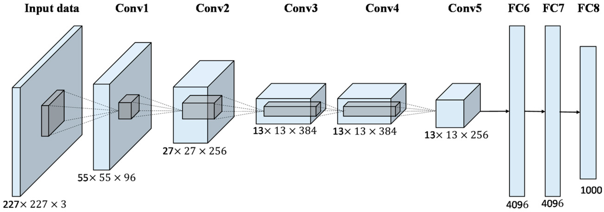

# DLA-Sex-Recognition

>  Questo è un progetto svolto nell'ambito dell'esame **Deep Learning and Applications Mod.1** del **CdLM in Informatica** presso l'Università degli Studi di Cagliari

| **Studente**          | **Matricola** | **E-Mail**                        |
|-----------------------|---------------|-----------------------------------|
| Federico Meloni       | 60/73/65243   | <f.meloni62@studenti.unica.it>    |
| Luca Faccin           | 60/73/65236   | <l.faccin@studenti.unica.it>      |

Questo progetto univeristario si pone l'obiettivo di classificare immagini del volto di persone famose in base al loro sesso attraverso diversi esperimenti di Deep Learning. Il dataset di partenza è [CelebA](https://mmlab.ie.cuhk.edu.hk/projects/CelebA.html), in particolare la versione [Align & Cropped](https://drive.google.com/drive/folders/0B7EVK8r0v71pTUZsaXdaSnZBZzg?resourcekey=0-rJlzl934LzC-Xp28GeIBzQ) che contiene le immagini già pulite, con le facce allineate e centrata. Il dataset è stato scelto per la sua semplicità e per la sua dimensione, che permette di eseguire i test in tempi ragionevoli.

Sonos stati effettuati tre diversi esperimenti, ognuno con un approccio diverso:
- Feature Extraction con AlexNet, ResNet e VGG16 per poi utilizzare un classificatore SVM Lineare
- Fine Tuning di una rete pre-addestrata
- Creazione di una rete da zero

<br>

> ### **Table of Contents**
> 1. [Stato dell'arte](#stato-arte)
>    - [AlexNet](#alexnet)
>    - [ResNet](#resnet)
>    - [VGG16](#vgg16)
>    - [SVM](#svm)
> 1. [Feature Extraction](#feature-extraction)
>    - [Caricamento dei dati](#fe-dataset)
>    - [Caricamento delle reti](#fe-reti)
>    - [Risultati](#fe-risultati)
> 1. [Fine Tuning](#fine-tuning)
>    - [Caricamento dei dati](#ft-dataset)
>    - [Caricamento delle rete](#ft-reti)
>    - [Fine Tuning](#ft-finetuning)
>    - [Risultati](#ft-risultati)
> 1. [Creazione di una rete da zero](#nuova-rete)
>

<br><br>

---

<br>

<a name="stato-arte"></a>

## **Stato dell'arte**

<br>

<a name="alexnet"></a>

### **AlexNet**
AlexNet è una rete neurale convolutiva utilizzata nella computer vision presentata nel 2012.
AlexNet consiste in 8 layer, 5 dei quali sono layer convolutivi, 2 sono layer fully connected e 1 è un layer di output.



Nel primo strato si riceve l'immagine come input e la si ridimensiona per adattarsi alla rete neurale, successivamente i cinque strati convolutivi itilizzano filtri per estrarre le caratteristiche visive dall'immagine.  
Ogni strato convolutivo utilizza un insieme di filtri che scorrono sull'immagine eseguendo una combinazione lineare dei valori dei pixel e producendo una nuova immaigne chiamata "*feature map*".  
Gli strati fully connected sono due e hanno la funzione di classificare l'immagine in base alle caratteristiche estratte dai layer convolutivi.  
Il layer di output è un layer softmax che restituisce la probabilità che l'immagine appartenga ad una delle 2 classi.

<br>

<a name="resnet"></a>

### **ResNet**

ResNet è una rete neurale convolutiva presentata nel 2015 da Microsoft Research Asia. Con i suoi 152 livelli, la versione completa di ResNet è un’architettura piuttosto complessa, quindi abbiamo optato per utilizzare la versione ResNet18.  
Per allenare un così alto numero di livelli utilizza un metodo detto "skip connection". Il quale prende i dati trasferiti al livello successivo e lo aggiungono anche al output di quelli precedenti come mostrato nella figura sottostante:


ResNet è organizzata in **blocchi residuali** *(residual block)*. 

Durante la **back propagation** e il **calcolo del metodo di ottimizzazione** (es. gradiente stocastico discendente) se il numero di livelli è troppo grande, il gradiente può diventare:
- molto grande (**exploding gradient**): causa problemi d’instabilità e genera parametri (weights) che superano quelli gestibili dal computer
- estremamente piccolo (**vanishing gradient**): determina un aggiornamento minimo dei pesi e causa un rallentamento del processo di training.

Grazie alla sua struttura, ResNet invece di aspettare che il gradiente si propaghi indietro (back propagation) un livello alla volta, il percorso di skip connection gli consente di raggiungere i nodi iniziali efficacemente saltando quelli intermedi.

<br>

<a name="vgg16"></a>

### **VGG16**
VGG16 è un modello di rete neurale convoluzionale presentato nel 2014 dall'Università di Oxford.
VGG16 prende in input immagini RGB di dimensione 224x224.


La rete è composta, come suggerisci il nome, da 16 layer, 13 dei quali sono layer convolutivi, 2 sono layer fully connected e 1 è un layer di output.

<br>

<a name="svm"></a>

### **SVM Lineare**
Le Support Vector Machine, o SVM, sono modelli di classificazione che mirano a trovare una linea di separazione delle classi che massimizzi il margine tra le classi stesse. 
Questo obiettivo viene raggiunto utilizzando una parte minima del set di dati di addestramento, i cosiddetti vettori di supporto (da cui il nome della famiglia di modelli).


La figura mostra qual è la linea di demarcazione che massimizza il margine tra  due classi di dati. La stella visibile e i due triangoli  sono i vettori di supporto, che sono gli unici esempi nel set di dati che si trovano sul bordo. Una volta trovati, tutti gli altri esempi nel dataset sono irrilevanti per la classificazione, in quanto definiscono la linea di demarcazione e il margine. 
I vettori di supporto rappresentano i valori di una classe più vicini alla linea di demarcazione e i valori più vicini all'altra classe. Fondamentalmente, questi sono i valori più difficili da essere classificati.
Maggiore è il margine, migliore è la generalizzazione. Il motivo è  semplice: maggiore è il margine, maggiore è la distanza tra le classi, e quindi il potenziale di  confusione.
<br><br>
Per fara la classificazione abbiamo usato la libreria "liblinear", e applicata tramite il seguente codice: 
```
YTrain = double(YTrain(:,1));
YTest = double(YTest(:,1));
```
Prima trasfomando le etichette da categoriche a variabili double in modo tale da poter essere usate più avanti
```
featuresTrain = sparse(double(featuresTrain));
featuresTest = sparse(double(featuresTest));
```
Successivamente abbiamo reso la matrice contente le features sparsa in modo da renderla più leggera e il processo di addestramento più snello.
```
model = train(YTrain, featuresTrain, options, '-s 2');
YPred = predict(YTest, featuresTest, model);
```
Infine eseguito l'addestramento (passando tutte i paramentri e variabili necessari) e la predizione sul Test set per poter valutare il modello.
<br><br>

---

<br>

<a name="feature-extraction"></a>

## **Feature Extraction**
Il primo esperimento consiste nell'utilizzare una rete neurale pre-addestrata per estrarre le caratteristiche visive dalle immagini e poi utilizzare un classificatore SVM Lineare per classificare le immagini in base al sesso.

Per fare ciò è stato utilizzato il dataset di partenza, che è stato suddiviso in due parti: una per il training e una per il testing.

Il modus operandi è il seguente:
1. Caricamento del dataset di training e di testing
2. Caricamento della rete neurale pre-addestrata e ridimensionamento delle immagini
3. Estrazione delle features dalle immagini estrapolando i dati dal penultimo layer della rete neurale
4. Training del classificatore SVM Lineare
5. Test del classificatore SVM Lineare

<br>

<a name="fe-risultati"></a>

### **Risultati**

```
AlexNet

init f 1.628e+05 |g| 1.985e+07
iter  1 f 6.720e+04 |g| 3.317e+06 CG   3 step_size 1.00e+00 
iter  2 f 4.669e+04 |g| 1.320e+06 CG   8 step_size 1.00e+00 
iter  3 f 3.950e+04 |g| 5.743e+05 CG   9 step_size 1.00e+00 
iter  4 f 3.420e+04 |g| 5.140e+05 CG  17 step_size 1.00e+00 
iter  5 f 3.365e+04 |g| 3.133e+05 CG   9 step_size 1.00e+00 
iter  6 f 3.322e+04 |g| 5.421e+05 CG   9 step_size 1.00e+00 
iter  7 f 3.284e+04 |g| 2.521e+05 CG   9 step_size 1.00e+00 
iter  8 f 3.065e+04 |g| 1.420e+05 CG  16 step_size 1.00e+00 
iter  9 f 3.052e+04 |g| 2.343e+05 CG   9 step_size 1.00e+00 
iter 10 f 3.043e+04 |g| 4.875e+04 CG   9 step_size 1.00e+00 

Accuracy = 93.3874% (18642/19962)
```


<br><br>

---

<br>

<a name="fine-tuning"></a>

## **Fine Tuning**

<br><br>

---

<br>

<a name="nuova-rete"></a>
``` 

## **Creazione di una rete da zero**


Il network che abbiamo creato ha la seguente struttura: 


Rappresenta cinque volte una ripetizione degli strati:

concludendo infine con gli strati fully connected, di dropout, softmax e infine di classificazione e output.
