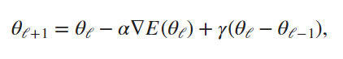

# Reti utilizzate

> ### **Table of Contents**
>
> NETWORKS
> - [AlexNet](#alexnet)
> - [ResNet-18](#resnet-18)
> - [ResNet-50](#resnet-50)
> - [VGG-16](#vgg-16)
>
> CLASSIFICATORE
> - [SVM](#svm)
>
> OTTIMIZZATORE
> - [SGDM](#sgdm)

 
 

# Networks
In questa sezione della documentazione andremo ad analizzare le varie reti utilizzate in tutti gli esperimenti del progetto.

 

## **AlexNet**
AlexNet è il nome dato a un'architettura di rete neurale convoluzionale che ha vinto il concorso LSVRC nel 2012.

La LSVRC (Large Scale Visual Recognition Challenge) è una competizione in cui i team di ricerca valutano i loro algoritmi su un enorme set di immagini etichettate (da ImageNet) e competono per ottenere una maggiore accuratezza su diversi compiti di riconoscimento visivo.

AlexNet consiste in 8 layer, 5 dei quali sono layer convolutivi, 2 sono layer fully connected e 1 è un layer di output.

Alla fine di ogni strato, viene eseguita l'attivazione ReLu, tranne che per l'ultimo, il quele produce un output con una softmax una distribuzione di probabilità sulle sue 1000 etichette di classe disponibili come output (impostazione originaria dell'archittuttura). Il dropout viene applicato nei primi due strati completamente connessi. I neuroni degli strati completamente connessi sono collegati a tutti i neuroni dello strato precedente.

### **Sezione di Convoluzione e Maxpooling**

- L'input: costituito da immagini di dimensioni 227X227X3.
- Primo strato di convoluzione: con 96 filtri di dimensione 11X11 con stride 4 (con stride si indica il numero di posizioni di cui si sposta ogni volta il filtro o il kernel lungo l'input). La funzione di attivazione utilizzata in questo strato è relu. La mappa delle caratteristiche in uscita è 55X55X96. Inoltre, il numero di filtri diventa il canale nella feature map di output.
- Primo livello di Maxpooling: di dimensioni 3X3 e stride 2. Si ottiene quindi la mappa di caratteristiche risultante con dimensioni 27X27X96.
- Seconda operazione di convoluzione: questa volta la dimensione del filtro è ridotta a 5X5 e abbiamo 256 filtri di questo tipo. Lo stride è 1 e il padding 2. La funzione di attivazione utilizzata è ancora una volta relu. Ora la dimensione di uscita ottenuta è 27X27X256.
- Secondo livello di max-pooling: di dimensioni 3X3 con stride 2. La mappa di caratteristiche risultante è di forma 13X13X256.
- Terza operazione di convoluzione: con 384 filtri di dimensione 3X3 stride 1 e anche padding 1. Anche in questo caso la funzione di attivazione utilizzata è relu. La features map in uscita è di dimensione 13X13X384.
- Quarta operazione di convoluzione: con 384 filtri di dimensione 3X3. Lo stride e il padding sono pari a 1. Inoltre, la funzione di attivazione utilizzata è relu. Ora la dimensione dell'uscita rimane invariata, cioè 13X13X384.
- Quinto e ultimo strato di convoluzione: di dimensioni 3X3 con 256 filtri di questo tipo. Lo stride e il padding sono impostati a uno e anche la funzione di attivazione è relu. La mappa di caratteristiche risultante è di forma 13X13X256.
- Terzo livello di max-pooling: di dimensioni 3X3 e passo 2. Il risultato è una feature map di dimensione 6X6X256.

### **Sezione fully connected e di Dropout**

- Primo livello di Dropout. Il tasso è impostato a 0,5.
- Primo strato fully connected con una funzione di attivazione relu. La dimensione dell'uscita è 4096. 
- Secondo strato di Dropout con un tasso fissato a 0,5.
- Secondo strato fully connected con 4096 neuroni e attivazione relu.
- Infine, abbiamo il terzo e ultimo strato fully connected o strato di output con 1000 neuroni, poiché si hanno 10000 classi nel set di dati. La funzione di attivazione utilizzata in questo strato è Softmax.

 

## **ResNet-50**
ResNet-50 è una rete neurale convoluzionale profonda utilizzata principalmente per la classificazione delle immagini, che è stata proposta per la prima volta nel 2015 da Kaiming He, Xiangyu Zhang, Shaoqing Ren e Jian Sun in un articolo intitolato "Deep Residual Learning for Image Recognition". La rete è stata progettata per superare il problema della scomparsa del gradiente, che si verifica quando la retropropagazione del gradiente attraverso molteplici strati della rete diventa molto difficile a causa della riduzione del gradiente.

ResNet-50 è costituita da 50 strati di convoluzione, ed è composta da un insieme di blocchi di tipo "residuale", che sono progettati per consentire alla rete di imparare a saltare uno o più strati durante la trasmissione dell'informazione. Questa caratteristica rende la rete più profonda e in grado di apprendere funzioni più complesse rispetto ad altre reti neurali convoluzionali.

L'architettura ResNet a 50 strati comprende i seguenti elementi, come mostrato nella tabella sotto:

- Un kernel di covoluzione 7×7 insieme ad altri 64 kernel con uno stride di 2 dimensioni. 
- Uno strato di max pooling con uno stride di 2 dimensioni. 
- Altri 9 strati-3×3,64 kernel di convoluzione, un altro con kernel 1×1,64 e un terzo con kernel 1×1,256. Questi 3 strati vengono ripetuti 3 volte. 
- Altri 12 strati con kernel 1×1,128, kernel 3×3.128 e kernel 1×1.512, iterati 4 volte. Altri 18 strati con core 1×1,256 e 2 core 3×3,256 e 1×1,1024, iterati 6 volte. - Altri 9 strati con core 1×1.512, core 3×3.512 e core 1×1.2048 iterati 3 volte.
- Average pooling, seguito da uno strato completamente connesso con 1000 nodi, utilizzando la funzione di attivazione softmax.

 

## **ResNet-18**
ResNet-18 è una rete neurale convoluzionale relativamente meno profonda rispetto a ResNet-50.  
È stata proposta per la prima volta nello stesso articolo che ha introdotto ResNet-50, ovvero "Deep Residual Learning for Image Recognition".
ResNet18 è un'architettura a 72 strati con 18 strati profondi. L'architettura di questa rete mira a consentire il funzionamento di un gran numero di strati convoluzionali in maniera efficiente.

L'idea principale di ResNet è l'uso di "jumping connections". Queste connessioni funzionano principalmente saltando su uno o più strati, formando scorciatoie tra questi strati. L'obiettivo dell'introduzione di queste connessioni di scorciatoia è quello di risolvere il problema predominante di vanificazione del gradiente che le reti profonde devono affrontare.

La struttura di ResNet-18:

- Input: immagini RGB di dimensione 224x224x3.
- Primo blocco: il primo blocco è costituito da un layer di convoluzione seguito da un layer di batch normalization e un'attivazione ReLU.

Quattro blocchi residui: come per ResNet-50, ci sono quattro blocchi residui in ResNet-18. Tuttavia, ogni blocco residuo in ResNet-18 contiene solo due sotto-blocchi invece di tre o cinque come in ResNet-50.
- Pooling globale: alla fine dell'ultimo blocco residuo, viene applicato un pooling globale sui dati di output della rete. Questo pooling globale riduce la dimensione dei dati in uscita e prepara la rete per il layer di output finale.
- Layer di output: infine, come in ResNet-50, viene aggiunto un layer di output completamente connesso costituito da un singolo neurone che calcola la probabilità che l'immagine in ingresso appartenga a una delle classi di destinazione.

In generale, la struttura di ResNet-18 è simile a quella di ResNet-50, ma con meno blocchi residui e meno strati convoluzionali all'interno di ogni blocco. Questa architettura è stata progettata per essere più leggera e più veloce rispetto a ResNet-50, ma comunque abbastanza profonda da ottenere buone prestazioni nella classificazione delle immagini.

 

## **VGG-16**
VGG16 è un modello di rete neurale convoluzionale presentato nel 2014 dall'Università di Oxford.
VGG16 prende in input immagini RGB di dimensione 224x224.

Il modello è stato addestrato sul dataset ImageNet, che contiene oltre 14 milioni di immagini appartenenti a 1.000 classi diverse, utilizzando una tecnica di ottimizzazione chiamata backpropagation. VGG-16 ha raggiunto un'accuratezza del 92,7% sul dataset di validation di ImageNet, rendendola una delle reti neurali convoluzionali più accurate al momento della sua creazione.

Inoltre, VGG-16 ha anche contribuito all'avanzamento delle tecniche di trasferimento dell'apprendimento, dove i pesi pre-addestrati della rete possono essere utilizzati per risolvere altri problemi di classificazione di immagini senza dover addestrare una nuova rete da zero.

La rete è composta, come suggerisci il nome, da 16 layer, 13 dei quali sono layer convolutivi, 2 sono layer fully connected e 1 è un layer di output. Ogni strato di convoluzione consiste in una serie di filtri di convoluzione che elaborano l'immagine di input per estrarne caratteristiche rilevanti, mentre i layer di pooling riducono la dimensionalità dell'output del layer precedente.

Il numero 16 in VGG16 si riferisce a 16 strati con pesi. Nel VGG16 ci sono tredici strati convoluzionali, cinque strati di Max Pooling e tre strati densi, per un totale di 21 strati, ma ha solo sedici strati pesati.
- VGG16 prende il tensore di ingresso di 224, 244 con 3 canali RGB.
- Gli strati di convoluzione e di max pool sono disposti in modo coerente nell'intera architettura.
- Lo strato Conv-1 ha 64 filtri, Conv-2 ha 128 filtri, Conv-3 ha 256 filtri, Conv 4 e Conv 5 hanno 512 filtri.
- Tre livelli Fully-Connected (FC) seguono una pila di livelli convoluzionali: i primi due hanno 4096 canali ciascuno, il terzo esegue una classificazione ILSVRC a 1000 vie e contiene quindi 1000 canali (uno per ogni classe). L'ultimo strato è il livello soft-max.

 
 

# Classificatore
Qui si analizza il classificatore utilizzato negli esperimenti di feature extraction.

 

## **SVM**
Le Support Vector Machine, o SVM, sono modelli di classificazione che mirano a trovare una linea di separazione delle classi che massimizzi il margine tra le classi stesse. 
Questo obiettivo viene raggiunto utilizzando una parte minima del set di dati di addestramento, i cosiddetti vettori di supporto (da cui il nome della famiglia di modelli).

    

La figura mostra qual è la linea di demarcazione che massimizza il margine tra  due classi di dati. La stella visibile e i due triangoli  sono i vettori di supporto, che sono gli unici esempi nel set di dati che si trovano sul bordo. Una volta trovati, tutti gli altri esempi nel dataset sono irrilevanti per la classificazione, in quanto definiscono la linea di demarcazione e il margine. 
I vettori di supporto rappresentano i valori di una classe più vicini alla linea di demarcazione e i valori più vicini all'altra classe. Fondamentalmente, questi sono i valori più difficili da essere classificati.
Maggiore è il margine, migliore è la generalizzazione. Il motivo è  semplice: maggiore è il margine, maggiore è la distanza tra le classi, e quindi il potenziale di  confusione.

 
 

# Ottimizzatore
In tutti gli esperimenti che lo richiedevano è stato utilizzato il seguente ottimizzatore, quindi ne vediamo le caratteristiche tecniche.

 

## **SGDM**
L'acronimo sta per "Stochastic Gradient Descent with Momentum, è un algoritmo di ottimizzazione cui valore può oscillare lungo il percorso di discesa verso l'ottimale. L'aggiunta di un termine di momento somma una frazione della direzione del passo precedente all'attuale direzione di discesa del gradiente, aiutando l'algoritmo a superare le aree di plateau e raggiungere più rapidamente la zona di minimo dell'errore, il momento viene specificato come scalare da 0 a 1. Un valore di 0 significa nessun contributo del passo precedente, mentre un valore di 1 significa il massimo contributo del passo precedente.

L'aggiornamento stocastico del gradiente discendente con slancio (SGDM) è:
 

    

 
dove γ determina il contributo del passo di all'iterazione corrente.

In pratica, durante il training di una rete neurale con SGDM, l'ottimizzatore calcola il gradiente dell'errore rispetto ai parametri del modello e utilizza il valore del momento per aggiornare i parametri. Questo processo viene ripetuto per un numero di iterazioni specificato dall'utente o fino a quando l'errore raggiunge un valore minimo desiderato.

L'utilizzo di SGDM può migliorare significativamente le prestazioni del modello rispetto all'utilizzo di SGD standard, soprattutto in presenza di una grande quantità di dati o di una complessità elevata del modello. Tuttavia, l'impostazione dei parametri corretti dell'ottimizzatore, come la velocità di apprendimento e il coefficiente di momento, può essere critica per ottenere i migliori risultati.

  

