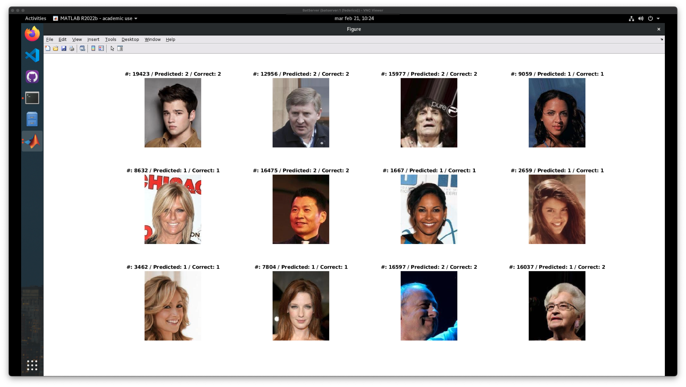
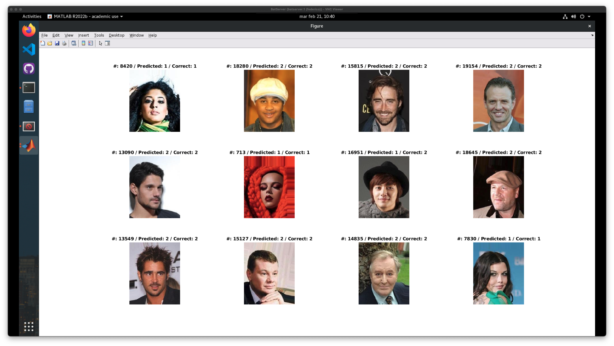
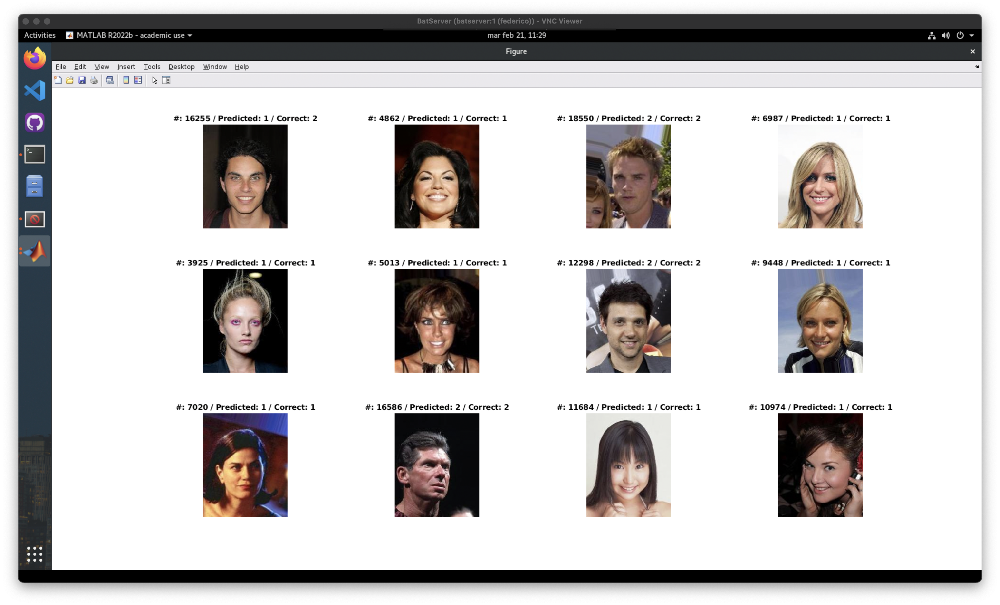

# Feature Extraction e classificazione con SVM

Nel primo esperimento abbiamo provveduto a estrarre le features dalle immagini utilizzando i modelli pre-addestrati di AlexNet, ResNet-18, ResNet-50 e VGG16. Successivamente abbiamo utilizzato un classificatore SVM per classificare le immagini in base al sesso.

Sono stati messi a disposizione dei flag di configurazione per decidere se visualizzare o meno alcuni esempi di img, alcune img classificate con i risultati delle predizioni e la matrice di confusione. Oltre a questo è possibile decidere quale delle quattro architetture utilizzare per l'estrazione delle features.

```MATLAB
% === VARIABILI SI STAMPA === %
printTrainingSet = 1;
printTestSet = 1;
printConfMatrix = 1;

% === RETE NEURALE DA USARE === %
network = 'alexnet';
network = 'resnet18';
network = 'resnet50';
network = 'vgg16';
```

<br>

## **Caricamento dei dati**
Per l'esecuzione di questi esperimenti vengono caricati train e test set. I dati sono stati caricati utilizzando degli `imageDatastore`, andando a leggere le immagini dalle cartelle corrispondendi all'interno della macro-cartella dataset. Ad ogni immagine è associata una label che indica il sesso dell'utente rappresentato e questa è stata recuperata dal nome della sottocartella in cui è contenuta l'immagine.

Una volta caricato il dataset si può decidere con la variabile `printTrainingSet` se visualizzare o meno alcune immagini del training set.

> AGGIUNGERE IMG

<br>

## **Caricamento del modello pre-addestrato**
Come anticipato sono stati eseguiti esperimenti utilizzando diverse reti, per ognuna di queste si sono estratte le feature delle immagini prendendole dall'ultimo livello fully connected prima del layer di classificazione. Per ogni rete poi si può decidere se far girare l'esperimento su `CPU`, `GPU` o `multi-GPU` in base all'inizializzazione della variabile `env`.  
Di seguito le nostre scelte per ogni rete in base alla stabilità della macchina utilizzata per l'esecuzione degli esperimenti:

```MATLAB
if network == "alexnet"
    net = alexnet;
    layer = 'fc7';
    env = 'gpu';
elseif network == "resnet18"
    net = resnet18;
    layer = 'pool5';
    env = 'multi-gpu';
elseif network == "resnet50"
    net = resnet50;
    layer = 'fc1000';
    env = 'gpu';
else
    net = vgg16;
    layer = 'fc7';
    env = 'gpu';
end
```

## Preprocessing delle img
Per ogni immagine viene effettuato un preprocessing per ottenere un input di dimensione consona alla rete scelta. Per fare ciò è stato utilizzato il metodo `augmentedImageDatastore` che permette di applicare delle trasformazioni alle immagini.  
Le dimensioni richieste sono di 227x227 per AlexNet e VGG16 e 224x224 per ResNet-18 e ResNet-50.

```MATLAB
inputSize = net. Layers(1). InputSize;
augimdsTrain = augmentedImageDatastore(inputSize(1:2), imdsTrain);
augimdsTest = augmentedImageDatastore(inputSize(1:2), imdsTest);
```

<br>

## **Estrazione delle features**
A questo punto vengono estratte le feature utilizzando il metodo `activations` che prende in input la rete, il dataset e il layer da cui estrarre le features.  
Oltre a questo sono state salvate le labels associate alle immagini per poterle utilizzare per la classificazione.

```MATLAB
featuresTrain1 = activations (net, augimdsTrain, layer, 'Outputs', 'rows', 'ExecutionEnvironment', env);
featuresTest1 = activations (net, augimdsTest, layer, 'outputAs', 'rows', 'ExecutionEnvironment', env);
Train = imdsTrain. Labels;
YTest = imdsTest.Labels;
```

<br>

## Classificazione con SVM
Dopo l'estrazione delle features viene utilizzato un classificatore SVM per classificare le immagini in base al sesso. Per mandare i dati in pasto al classificatore è stato necessario fare una conversione delle labels e delle features a `double`, e la matrice delle features è stata anche modificata per diventare una matrice sparsa per cercare di rispiarmiare un po' di spazio.

```MATLAB
Train = double (YTrain(:, 1));
YTest = double(YTest (:, 1));
featuresTrain = sparse (double (featuresTrain1));
featuresTest = sparse (double(featuresTest1));
```

 E dopo aver impostato le opzioni dell'addestramento si è potuto procedere con l'addestramento del classificatore e alla predizione delle labels sul test set.

```MATLAB
options = trainingOptions ('sgdm',
    'LearnRateSchedule', 'piecewise'
    'LearnRateDropFactor', 0.2, ...
    'LearnRateDropPeriod', 5, ...
    'MaxEpochs', 10, ...
    'MiniBatchsize',128, ...
    'Plots', 'training-progress', ...
    'ExecutionEnvironment', 'multi-gpu');

model = train(Train, featuresTrain, options, '-s 2');

YPred = predict(YTest, featuresTest, model);
```
Di seguito verranno spiegate le opzioni dell'addestramento:
*L'opzione `sgdm` indica l'ottimizzatore scelto, ovvero la discesa stocastica del gradiente
*'LearnRateSchedule' indica che il tasso di apprendimento del modello verrà modificato in base ad uno schema predefinito.
*'LearnRateDropFactor' indica la frazione di riduzione del tasso di apprendimento. In questo caso, il tasso di apprendimento verrà ridotto del 20% quando viene raggiunto il periodo di riduzione del tasso di apprendimento, poiché come paramentro è impostato 0,2.
*'LearnRateDropPeriod' indica dopo quanti epoch il tasso di apprendimento deve essere ridotto.
*'MaxEpochs' indica il numero massimo di epoche per cui il modello viene addestrato.
*'MiniBatchsize' indica la dimensione del batch di dati utilizzati per ogni iterazione durante il training.
*'Plots', 'training-progress' è stato indicato che il plot deve mostrare la progressione del training ed essere visualizzato.
*'ExecutionEnvironment', 'multi-gpu' indica che il training verrà eseguito su più di una GPU, abbiamo usato questa oppzione poiché va bene sia per le multi-gpu nel caso siano disponibili che per le singole in quanto la singola viene considerata come un array con un singolo elemento.


<br>

## Risultati degli esperimenti

Possiamo notare come i risultati migliori in termini assoluti provengano dalla rete ResNet-50, seguita da VGG16 e AlexNet.  
Resnet-50, oltre ad avere le prestazioni migliori, si è rivelata essere la seconda rete più veloce a concludere l'esperimento.

|          | AlexNet *(1GPU)*  | ResNet-18 *(2GPU)* | ResNet-50 *(1GPU)*  | VGG16 *(1GPU)* |
| -------  | --------------- | ---------------- | ----------------- | ------------ |
| Accuracy | 93.29%          | 92.71%           | 94.76%            | 93.37%       |
| Rateo    | 18623/19962     | 18507/19962      | 18916/19962       | 18638/19962  |
| Time     | 380.5152s       | 206.0166s        | 285.4249s         | 739.1441s    |

Di seguito possiamo analizzare i risultati ottenuti per ogni rete andando a vedere la matrice di confusione e qualche esempio di classificazione.

<br>

**AlexNet**
<table>
<tr><td>


|               | **T Female**          |  **T Male**           |
| ---           | ---                   | ---                   |
| **P Female**  |  93.8% <br> (11488)   |  7.5% <br> (580)      |
| **P Male**    |  6.2% <br> (759)      |  92.5% <br> (7135)    |

</td><td>



</td></tr> </table>


Resnet-18
<table>
<tr><td>


|               | **T Female**          |  **T Male**           |
| ---           | ---                   | ---                   |
| **P Female**  |  93.3% <br> (11426)   |  8.5% <br> (634)      |
| **P Male**    |  6.7% <br> (821)      |  91.6% <br> (7081)    |

</td><td>



</td></tr> </table>


Resnet-50 confusion 

<table>
<tr><td>

|               | **T Female**          |  **T Male**           |
| ---           | ---                   | ---                   |
| **P Female**  |  95.3% <br> (11671)   |  6.1% <br> (470)      |
| **P Male**    |  4.7% <br> (576)      |  93.9% <br> (7245)    |


</td><td>


</td></tr> </table>


VGG16 confusion 

<table>
<tr><td>

|               | **T Female**          |  **T Male**           |
| ---           | ---                   | ---                   |
| **P Female**  |  93.8% <br> (11488)   |  7.5% <br> (580)      |
| **P Male**    |  6.2% <br> (762)      |  97.7% <br> (7153)    |

</td><td>



</td></tr> </table>


<br>

## Conclusioni
Come possiamo notare in tutti gli esperimenti le reti neurali sono riuscite a classificare correttamente il sesso di una persona con un'accuratezza superiore al 92.7%. Nei pochi casi in cui la rete ha sbagliato, come possiamo notare nei due esempi di ResNet-18 e di VGG16, in entrambi i casi i soggetti avevano capelli lunghi, non era visibile il pomo d'adamo e i lineamenti sono tondeggianti.


<br>
<br>

# FINE TUNING ALEXNET
|               |                 |
| -----------   | --------------- |
| **Acc. Val**  | 97.43%          |
| **Acc. Test** | 96.59%          |
| **Rateo**     | 19281/19962     |  
| **Time**      | 28071.5158s     |  

Fine Tuned Alexnet confusion
|               | **T Female**          |  **T Male**           |
| ---           | ---                   | ---                   |
| **P Female**  |  96.8% <br> (11857)   |  3.8% <br> (291)      |
| **P Male**    |  3.2% <br> (390)      |  96.2% <br> (7424)    |
