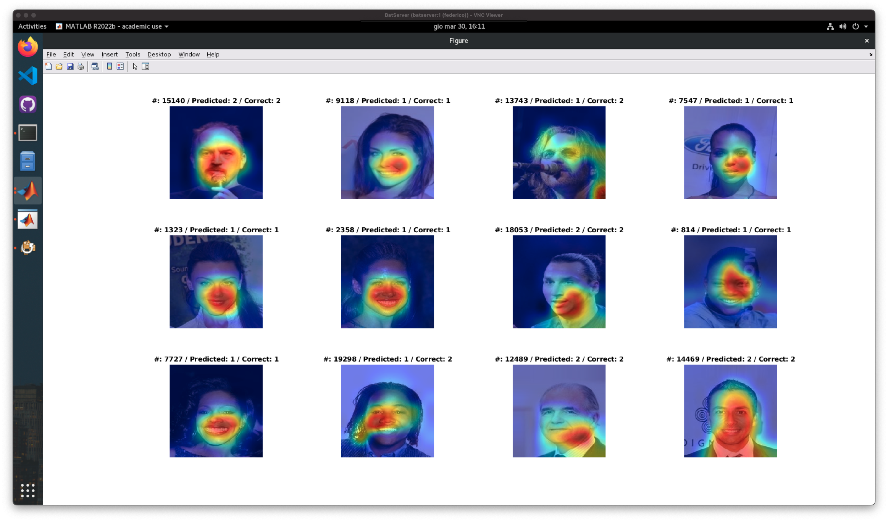

# Finetuning di una rete pre-addestrata
In questo esperimento abbiamo preso AlexNet e abbiamo fatto un finetuning, cioé un riaddestramento degli ultimi livelli della rete per adattarla al nostro problema, lasciando invariati i primi livelli della rete.

>
> ### **Table of Contents**
>
>   1. [Flag e impostazioni](#flag-e-impostazioni)
>   1. [Caricamento dei dati](#caricamento-dei-dati)
>   1. [Caricamento della rete e ridimensionamento](#caricamento-della-rete-e-ridimensionamento)
>   1. [Fine-tuning](#fine-tuning)
>   1. [Risultati](#risultati)
>   1. [Analisi dei risultati e degli errori con l'utilizzo dei metadati](#analisi-dei-risultati-e-degli-errori-con-lutilizzo-dei-metadati)
>   1. [Conclusioni](#conclusioni)
>
> File di riferimento: [`finetuning.mlx`](../finetuning.mlx)  +  [`finetuning_analysis.mlx`](../finetuning.mlx)
>

<br>

## **Flag e impostazioni**
All'inizio del file è possibile impostare alcune variabili che influenzano il comportamento del programma. Queste sono tre variabili che regolano la stampa di alcune informazioni durante l'esecuzione del programma, in maniera simile a quello fatto negli altri esperimenti.

```MATLAB
% === VARIABILI SI STAMPA === %
printTrainingSet = 1;
printTestSet = 1;
printConfMatrix = 1;
printGradMap = 1;

% === SELEZIONE RETE === %
network = "alexnet";
network = "resnet50";
numClasses = 2;
```

Per selezionare la rete di cui fare il finetuning basta andare a commentare le altre opzioni disponibili.

<br>

## **Caricamento dei dati**
Per caricare i dati abbiamo utilizzato il metodo `imageDatastore` che permette di caricare le immagini e le label associate. In questo caso abbiamo caricato le immagini di training, validation e test set, ognuno dei quali corrisponde ad una cartella nella cartella del dataset.  
Per ogni immagine è stata associata una label che indica il sesso dell'utente rappresentato e questa è stata recuperata dal nome della sottocartella in cui è contenuta l'immagine.

```MATLAB
% caricamento dei dati
imdsTrain = imageDatastore ('dataset/TrainSet/', 'IncludeSubfolders', true, 'LabelSource', 'foldernames');
imsValidation = imageDatastore ('dataset/ValSet', 'IncludeSubfolders', true, 'Labelsource', 'foldernames');
imdsTest = imageDatastore ('dataset/TestSet/', 'IncludeSubfolders', true, 'LabelSource', 'foldernames');
%numero di dati caricati
numTrainImages = numel (imdsTrain.Labels);
numValImages = numel(imsValidation.Labels);
numTestImages = numel(imdsTest.Labels);
```

<br>

## **Caricamento della rete e ridimensionamento**
In base alla scelta effettuata all'inizio viene caricata Alexnet o Resnet50 e dopodiché sono state ridimensionate le immagini in modo da essere compatibili con la rete scelta.

```MATLAB
% caricamento della rete
if network == "alexnet"
    net = alexnet;
elseif network == "resnet50"
    net = resnet50;
end

% ridimensionamento delle immagini
inputSize = net.Layers(1). InputSize;
augimdsTrain = augmentedImageDatastore(inputSize(1:2), imdsTrain);
augimdsValidation = augmentedImageDatastore(inputSize(1:2), imdsValidation);
augimdsTest = augmentedImageDatastore (inputSize(1:2), imdsTest);
```

<br>

## **Fine-tuning**
Per effettuare il fine-tuning sono salvati tutti i layer della rete tranne gli ultimi tre, questi in entrambe le reti sono stati sostituiti con tre nuovi, per poi riaddestrare la rete risultante.  
I layer aggiunti, per entrambe le reti, sono un fully connected layer con 2 neuroni (numero pari a quello delle classi), una funzione di softmax layer per normalizzare l'output della rete neurale e produrre le probabilità delle diverse classi, infine un layer di classificazione che assegna una classe agli input sulla base delle probabilità calcolate dallo strato softmax.

```MATLAB
if network == "alexnet"
    freezedLayers = net.Layers (1:end-3);
    
    layers = [
        freezedLayers
        fullyConnectedLayer (numClasses, .
            'WeightLearnRateFactor', 20, .
            'BiasLearnRateFactor'.20)
        softmaxLayer classificationLayer];

elseif network == "resnet50"
    
    lgraph = layerGraph(net);

    newFCLayer = fullyConnectedLayer (numclasses, ...
        'Name', 'custom_fc', ...
        'WeightLearnRateFactor', 20, ...
        'BiasLearnRateFactor', 20);
    newsoftmaxLayer = softmaxLayer('Name', 'custom_sm');
    newclassificationLayer = classificationLayer('Name', 'custom_classout');

    lgraph = replaceLayer (lgraph, 'fc1000', newFCLayer);
    lgraph = replaceLayer (lgraph, 'fc1000_softmax', newsoftmaxLayer);
    lgraph = replaceLayer (lgraph, 'classificationLayer_fc1000', newClassificationLayer);
end
```

Dopo aver definito i layer è stato definito un oggetto `trainingOptions` che contiene le impostazioni per l'addestramento della rete e infine è stato avviato l'addestramento.

```MATLAB
options = trainingOptions ('sgdm',...
    'MiniBatchSize', 256, ...
    'MaxEpochs', 6, ...
    'InitialLearnRate', 1e-4, ...
    'Shuffle', 'every-epoch'
    'ValidationData', augimsValidation, ...
    'ValidationFrequency', 3, ...
    'Verbose', false, ...
    'Plots', 'training-progress',...
    'ExecutionEnvironment', 'gpu');

if network == "alexnet"
    netTransfer = trainNetwork(augimdsTrain, layers, options);
elseif network == "resnet50"
    netTransfer = trainNetwork(augimdsTrain, lgraph, options);
end
```

Dato che si tratta di un fine-tuning abbiamo scelto un numero di epoche basso pari a 6.

| Alexnet | Resnet50 |
| :---: | :---: |
|  |  |

<br>

## **Risultati**
Dopo aver addestrato la rete è stato calcolato l'errore sul test set e la matrice di confusione ottenendo i seguenti risulati:

<table>

<tr>
<th align=center colspan=2>Results</th>
</tr>

<tr align=center>
<th align=center><b>Alexnet FT</b></th>
<th align=center><b>Resnet50 FT</b></th>
</tr>

<td>

<table>
<tr>
<td><b>Acc. Val</b></td>
<td>97.43%</td>
</tr>

<tr>
<td><b>Acc. Test</b></td>
<td>96.59%</td>
</tr>

<tr>
<td><b>Rateo</b></td>
<td>19281/19962</td>
</tr>

<tr>
<td><b>Time</b></td>
<td>28071.5158s <br> (≈ 7.8h)</td>
</tr>
</table>

</td>

<td>

<table>
<tr>
<td><b>Acc. Val</b></td>
<td>97.63%</td>
</tr>

<tr>
<td><b>Acc. Test</b></td>
<td>97.24%</td>
</tr>

<tr>
<td><b>Rateo</b></td>
<td>19412/19962</td>
</tr>

<tr>
<td><b>Time</b></td>
<td>126785.6551s <br> (≈ 35.22h)</td>
</tr>
</table>

</td>
</tr>


<tr>
<th align=center colspan=2>Confusion Maps</th>
</tr>

<tr>
<th align=center><b>Alexnet CM</b></th>
<th align=center><b>Resnet50 CM</b></th>
</tr>

<tr>
<td>

|               | **T Female**          |  **T Male**           |
| ---           | ---                   | ---                   |
| **P Female**  |  96.8% <br> (11857)   |  3.8% <br> (291)      |
| **P Male**    |  3.2% <br> (390)      |  96.2% <br> (7424)    |

</td>

<td>

|               | **T Female**          |  **T Male**           |
| ---           | ---                   | ---                   |
| **P Female**  |  98.6% <br> (12070)   |  4.8% <br> (373)      |
| **P Male**    |  1.4% <br> (177)      |  95.2% <br> (7342)    |

</td>
</tr>
</table>

Di seguito possiamo osservare alcune immagini di test e la loro classificazione effettuata dalla rete, con una gradcam per evidenziare le parti dell'immagine che hanno contribuito maggiormente alla classificazione.

<table>
<tr>
<th align=center colspan=2>Alexnet</th>
</tr>

<tr>
<td>


</td>
<td>


</td>
</tr>

<tr>
<th align=center colspan=2>Resnet</th>
</tr>

<tr>
<td>


</td>
<td>


</td>
</tr>

</table>

Come possiamo notare AlexNet si concentra di più sul collo, dove è presente o meno il pomo d'adamo, e sul viso, nella zona inferiore, dove può essere presente o meno la barba e dove sono ben distinguibili i tratti maschili da quelli femminili con zigomi e mento più pronunciati.  
Al contrario Resnet possiamo notare come si concentri di più sul centro del viso, prediligendo occhi, naso, bocca e mento, ma sopratutto possiamo notare le sue difficoltà nei casi in cui il soggetto abbia una carnagione molto simile a quella dello sfondo (non riuscendo a capire dove concentrarsi) e nelle immagini in cui il soggetto si trova di profilo.

<br>

## **Analisi dei risultati e degli errori con l'utilizzo dei metadati**

Per effettuare un analisi degli errori ci siamo concentrati sul modello che ha avuto performance migliori, quindi su ResNet-50.

<br>

> **NB:** il file di riferimento per questa sezione è [`finetuning_analysis.mlx`](../finetuning_analysis.mlx)

<br>

Inizialmente siamo andati a vedere gli errori dal punto di vista generale.

<table>
<td>

</td>
<td>

</td>
</table>

Notiamo, come successo negli altri esperimenti, che molti degli errori di predizione sono causati da occlusione (mani, capelli o oggetti di fronte al viso), ricostruzione dell'immagine durante il preprocessing o espressioni facciali molto accentuate. Altre ragioni, sempre presenti tra le cause di errore nella computer vision, sono l'illuminazione scarsa/non uniforme e la prospettiva da cui viene inquadrato il soggetto dell'esperimento, tra gli esempi abbiamo un viso inquadrato dal basso.

Successivamente abbiamo provato ad isolare, grazie all'utilizzo dei metadati a nostra disposizione, le immagini con determinate caratteristiche per cercare di capire gli elementi che confondono di più il modello al momento della classificazione.

<table>

<!-- Calvi-->
<tr>
<th align=center colspan=3><b>Calvi</b></th>
</tr>
<tr>
<td>

</td>
<td>

</td>
<td>
<table>
<th align=center colspan=3>Accuracy: 99.76%</th>
<tr>
<td></td>
<td><b>T Fem</b></td>
<td><b>T Mal</b></td>
</tr>
<tr>
<td><b>T Fem</b></td>
<td>100%<br>(1)</td>
<td>0.2%<br>(1)</td>
</tr>
<tr>
<td><b>T Mal</b></td>
<td>0%<br>(0)</td>
<td>99.8%<br>(421)</td>
</tr>
</table>
</td>
</tr>

<!-- Frangetta-->
<tr>
<th align=center colspan=3><b>Frangetta</b></th>
</tr>
<tr>
<td>

</td>
<td>

</td>
<td>
<table>
<th align=center colspan=3>Accuracy: 96.53%</th>
<tr>
<td></td>
<td><b>T Fem</b></td>
<td><b>T Mal</b></td>
</tr>
<tr>
<td><b>T Fem</b></td>
<td>98.6%<br>(2554)</td>
<td>13.7%<br>(71)</td>
</tr>
<tr>
<td><b>T Mal</b></td>
<td>1.4%<br>(37)</td>
<td>86.3%<br>(447)</td>
</tr>
</table>
</td>
</tr>

<!-- Grandi labbra -->
<tr>
<th align=center colspan=3><b>Grandi labbra</b></th>
</tr>
<tr>
<td>

</td>
<td>

</td>
<td>
<table>
<th align=center colspan=3>Accuracy: 97.58%</th>
<tr>
<td></td>
<td><b>T Fem</b></td>
<td><b>T Mal</b></td>
</tr>
<tr>
<td><b>T Fem</b></td>
<td>99.4%<br>(4770)</td>
<td>7.4%<br>(131)</td>
</tr>
<tr>
<td><b>T Mal</b></td>
<td>0.6%<br>(27)</td>
<td>92.4%<br>(1600)</td>
</tr>
</table>
</td>
</tr>

<!-- Soppracciglia folte -->
<tr>
<th align=center colspan=3><b>Soppracciglia folte</b></th>
</tr>
<tr>
<td>

</td>
<td>

</td>
<td>
<table>
<th align=center colspan=3>Accuracy: 98.30%</th>
<tr>
<td></td>
<td><b>T Fem</b></td>
<td><b>T Mal</b></td>
</tr>
<tr>
<td><b>T Fem</b></td>
<td>98.8%<br>(812)</td>
<td>1.9%<br>(34)</td>
</tr>
<tr>
<td><b>T Mal</b></td>
<td>1.2%<br>(10)</td>
<td>98.1%<br>(1730)</td>
</tr>
</table>
</td>
</tr>

<!-- Doppio mento -->
<tr>
<th align=center colspan=3><b>Doppio mento</b></th>
</tr>
<tr>
<td>

</td>
<td>

</td>
<td>
<table>
<th align=center colspan=3>Accuracy: 97.26%</th>
<tr>
<td></td>
<td><b>T Fem</b></td>
<td><b>T Mal</b></td>
</tr>
<tr>
<td><b>T Fem</b></td>
<td>95.6%<br>(130)</td>
<td>2.4%<br>(19)</td>
</tr>
<tr>
<td><b>T Mal</b></td>
<td>4.4%<br>(6)</td>
<td>97.6%<br>(758)</td>
</tr>
</table>
</td>
</tr>

<!-- Occhiali -->
<tr>
<th align=center colspan=3><b>Occhiali</b></th>
</tr>
<tr>
<td>

</td>
<td>

</td>
<td>
<table>
<th align=center colspan=3>Accuracy: 93.41%</th>
<tr>
<td></td>
<td><b>T Fem</b></td>
<td><b>T Mal</b></td>
</tr>
<tr>
<td><b>T Fem</b></td>
<td>89.9%<br>(285)</td>
<td>5.5%<br>(53)</td>
</tr>
<tr>
<td><b>T Mal</b></td>
<td>10.1%<br>(32)</td>
<td>94.5%<br>(919)</td>
</tr>
</table>
</td>
</tr>

<!-- Pizzetto -->
<tr>
<th align=center colspan=3><b>Pizzetto</b></th>
</tr>
<tr>
<td>

</td>
<td>

</td>
<td>
<table>
<th align=center colspan=3>Accuracy: 99.45%</th>
<tr>
<td></td>
<td><b>T Fem</b></td>
<td><b>T Mal</b></td>
</tr>
<tr>
<td><b>T Fem</b></td>
<td>NaN<br>(0)</td>
<td>0.5%<br>(5)</td>
</tr>
<tr>
<td><b>T Mal</b></td>
<td>NaN<br>(0)</td>
<td>99.5%<br>(910)</td>
</tr>
</table>
</td>
</tr>

<!-- Trucco pesante -->
<tr>
<th align=center colspan=3><b>Trucco pesante</b></th>
</tr>
<tr>
<td>

</td>
<td>

</td>
<td>
<table>
<th align=center colspan=3>Accuracy: 99.67%</th>
<tr>
<td></td>
<td><b>T Fem</b></td>
<td><b>T Mal</b></td>
</tr>
<tr>
<td><b>T Fem</b></td>
<td>99.8%<br>(8048)</td>
<td>59.1%<br>(13)</td>
</tr>
<tr>
<td><b>T Mal</b></td>
<td>0.2%<br>(14)</td>
<td>40.9%<br>(9)</td>
</tr>
</table>
</td>
</tr>

<!-- Baffi-->
<tr>
<th align=center colspan=3><b>Baffi</b></th>
</tr>
<tr>
<td>

</td>
<td>

</td>
<td>
<table>
<th align=center colspan=3>Accuracy: 99.76</th>
<tr>
<td></td>
<td><b>T Fem</b></td>
<td><b>T Mal</b></td>
</tr>
<tr>
<td><b>T Fem</b></td>
<td>NaN%<br>(0)</td>
<td>1.7%<br>(13)</td>
</tr>
<tr>
<td><b>T Mal</b></td>
<td>NaN<br>(0)</td>
<td>98.3%<br>(759)</td>
</tr>
</table>
</td>
</tr>

<!-- Stempiatura-->
<tr>
<th align=center colspan=3><b>Stempiatura</b></th>
</tr>
<tr>
<td>

</td>
<td>

</td>
<td>
<table>
<th align=center colspan=3>Accuracy: 96.46</th>
<tr>
<td></td>
<td><b>T Fem</b></td>
<td><b>T Mal</b></td>
</tr>
<tr>
<td><b>T Fem</b></td>
<td>96.2%<br>(678)</td>
<td>3.3%<br>(33)</td>
</tr>
<tr>
<td><b>T Mal</b></td>
<td>3.8%<br>(27)</td>
<td>96.7%<br>(956)</td>
</tr>
</table>
</td>
</tr>

<!-- Orecchini -->
<tr>
<th align=center colspan=3><b>Orecchini</b></th>
</tr>
<tr>
<td>

</td>
<td>

</td>
<td>
<table>
<th align=center colspan=3>Accuracy: 98.23%</th>
<tr>
<td></td>
<td><b>T Fem</b></td>
<td><b>T Mal</b></td>
</tr>
<tr>
<td><b>T Fem</b></td>
<td>99.1%<br>(3907)</td>
<td>20.3%<br>(37)</td>
</tr>
<tr>
<td><b>T Mal</b></td>
<td>0.9%<br>(36)</td>
<td>79.7%<br>(145)</td>
</tr>
</table>
</td>
</tr>

<!-- Cappello -->
<tr>
<th align=center colspan=3><b>Cappello</b></th>
</tr>
<tr>
<td>

</td>
<td>

</td>
<td>
<table>
<th align=center colspan=3>Accuracy: 94.76%</th>
<tr>
<td></td>
<td><b>T Fem</b></td>
<td><b>T Mal</b></td>
</tr>
<tr>
<td><b>T Fem</b></td>
<td>94.2%<br>(261)</td>
<td>5.0%<br>(28)</td>
</tr>
<tr>
<td><b>T Mal</b></td>
<td>5.8%<br>(16)</td>
<td>95.0%<br>(534)</td>
</tr>
</table>
</td>
</tr>

<!-- Rossetto -->
<tr>
<th align=center colspan=3><b>Rossetto</b></th>
</tr>
<tr>
<td>

</td>
<td>

</td>
<td>
<table>
<th align=center colspan=3>Accuracy: 99.41%</th>
<tr>
<td></td>
<td><b>T Fem</b></td>
<td><b>T Mal</b></td>
</tr>
<tr>
<td><b>T Fem</b></td>
<td>99.7%<br>(10337)</td>
<td>57.4%<br>(27)</td>
</tr>
<tr>
<td><b>T Mal</b></td>
<td>0.3%<br>(34)</td>
<td>42.6%<br>(20)</td>
</tr>
</table>
</td>
</tr>

</table>

Come possiamo notare dai test, elementi come rossetto, trucco pesante, orecchini e frangetta aumentano l'errore nella predizione maschile, mentre elementi come occhiali aumentano l'errore per quanto riguarda la predizione femminile.

<br>

## **Conclusioni**
AlexNet, col suo fine-tuning ottenuto un'accuratezza di circa il 97.4% sul validation set e circa il 96.6% sul test set, con un tempo di addestramento di circa 7 ore e 45 minuti. ResNet-50, invece, ha ottenuto un accuratezza di circa il 97.6% sul validation set e circa il 97.2% sul test set, con un tempo di addestramento di circa un giorno e mezzo.
Se mettiamo a confronto gli esperimenti con quelli di feature extraction e classificazione SVM analoghi, abbiamo ottenuto un delta positivo in accuracy sul test set del 3.3% per AlexNet e del 2.48% per quanto riguarda ResNet-50. Se andiamo a considerare nel confronto anche l'esperimento con l'utilizzo dei metadati su questo abbiamo ottenuto un delta positivo rispettivamente del 0.22/0.23% e del 0.33/0.27% in accuracy sul test set.

|              | **AlexNet FT** | **AlexNet FE** | **AlexNet FE w/ metadata** | **AlexNet w/ metadata & norm** |
| -----------  | -------------  | -------------- | -------------------------- | ------------------------------ |
| **Accuracy** | 96.59%         | 93.29%         | 96.36%                     | 96.37%                         |
| **Delta**    | /              | -3.3%          | -0.23%                     | -0.22%                         |

<br>

|              | **ResnNet-50 FT** | **ResNet-50 FE** | **ResNet-50 FE w/ metadata** | **ResNet-50 w/ metadata & norm** |
| -----------  | ----------------  | ---------------- | ---------------------------- | -------------------------------- |
| **Accuracy** | 97.24%            | 94.76%           | 96.91%                       | 96.97%                           |
| **Delta**    | /                 | -2.48%           | -0.33%                       | -0.27%                           |

Se prendiamo in considerazione tutti gli altri esperimenti effettuati in precedenza possiamo notare che il fine-tuning di ResNet-50 raggiunge un accuracy superiore di tutti gli esperimenti (compreso il finetuning di AlexNet), mentre quello di AlexNet della maggior parte degli esperimenti, a parte qualcuno, sempre ascrivibile agli esperimenti con l'utilizzo dei metadati.

|              | **ResnNet-50 FT** | **AlexNet FT** | **ResNet-50 FE w/ md** | **ResNet-50 w/ md & norm** | **VGG16 w/ md & norm** |
| -----------  | ----------------  | -------------  | ---------------------- | -------------------------- | ---------------------- |
| **Accuracy** | 97.24%            | 96.59%         | 96.91%                 | 96.97%                     | 96.64%                 |
| **Delta**    | /                 | -0.65%         | -0.33%                 | -0.27%                     | -0.6%                  |

Il miglior risultato di feature extraction e classificazione SVM ottenuto senza l'utilizzo dei metadati è stato quello ottenuto con ResNet-50, con un accuracy del 94.76% sul test set, il che lo pone l'1.83% sotto il risultato ottenuto con il fine-tuning di AlexNet e 2.83% sotto il fine-tuning di ResNet-50.

Preso atto dei risultati ottenuti e tenendo conto che il fine-tuning di AlexNet ha richiesto circa 7 ore e 45 minuti e quello di ResNet più di 35 ore, mentre tutti gli esperimenti di feature extraction con classificazione SVM con ResNet-50 hanno richiesto meno di 5 minuti, possiamo concludere che il fine-tuning non è il metodo migliore per questo problema se siamo in possesso di metadati come nel nostro caso in quanto lo scarto sull'accuracy è irrisorio e ha sicuramente margini di miglioramento. In un caso generale, con l'utilizzo delle sole immagini, dipende quanto è importante uno scarto del 2.5% in accuracy al fronte dell'abisso presente per quanto riguarda i tempi di addestramento, tenendo conto che comunque si ragiungono percentuali di accuracy vicine al 95% con la feature extractione di ResNet-50 e la classficazione SVM.