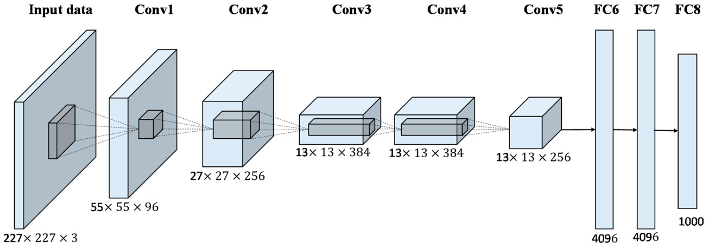
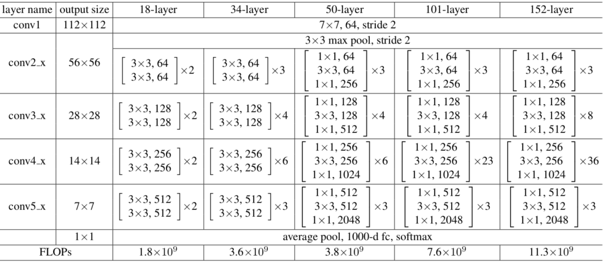
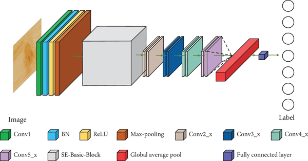

# Reti utilizzate

> ### **Table of Contents**
> - [AlexNet](#alexnet)
> - [ResNet-18](#resnet-18)
> - [ResNet-50](#resnet-50)
> - [VGG16](#vgg16)
> - [SVM](#svm)

 
## **AlexNet**
AlexNet è il nome dato a un'architettura di rete neurale convoluzionale che ha vinto il concorso LSVRC nel 2012.

La LSVRC (Large Scale Visual Recognition Challenge) è una competizione in cui i team di ricerca valutano i loro algoritmi su un enorme set di immagini etichettate (da ImageNet) e competono per ottenere una maggiore accuratezza su diversi compiti di riconoscimento visivo.

AlexNet consiste in 8 layer, 5 dei quali sono layer convolutivi, 2 sono layer fully connected e 1 è un layer di output.

Alla fine di ogni strato, viene eseguita l'attivazione ReLu, tranne che per l'ultimo, il quele produce un output con una softmax una distribuzione di probabilità sulle sue 1000 etichette di classe disponibili come output (impostazione originaria dell'archittuttura). Il dropout viene applicato nei primi due strati completamente connessi. I neuroni degli strati completamente connessi sono collegati a tutti i neuroni dello strato precedente.

## **AlexNet**
AlexNet è una rete neurale convolutiva utilizzata nella computer vision presentata nel 2012.
AlexNet consiste in 8 layer, 5 dei quali sono layer convolutivi, 2 sono layer fully connected e 1 è un layer di output.

Nel primo strato si riceve l'immagine come input e la si ridimensiona per adattarsi alla rete neurale, successivamente i cinque strati convolutivi itilizzano filtri per estrarre le caratteristiche visive dall'immagine.  
Ogni strato convolutivo utilizza un insieme di filtri che scorrono sull'immagine eseguendo una combinazione lineare dei valori dei pixel e producendo una nuova immagine chiamata "*feature map*".  
Gli strati fully connected sono due e hanno la funzione di classificare l'immagine in base alle caratteristiche estratte dai layer convolutivi.  
Il layer di output è un layer softmax che restituisce la probabilità che l'immagine appartenga ad una delle 2 classi.

AlexNet è composta da 8 strati principali, di cui i primi 5 sono convoluzionali e gli ultimi 3 sono completamente connessi.

- L'input è un'immagine di input RGB (rosso, verde, blu) di dimensione 224x224.
- Nel primo strato questa immagine viene convoluta con 96 filtri di dimensione 11x11, con uno stride di 4 pixel. Ciò significa che ogni filtro scansiona l'immagine con un movimento di 4 pixel alla volta. Il risultato di questa convoluzione è una mappa di caratteristiche di dimensioni 55x55x96.
- Il secondo strato è una mappa di caratteristiche ottenuta convolvendo la mappa di caratteristiche del primo strato con 256 filtri di dimensione 5x5, con uno stride di 1 pixel. Il risultato di questa convoluzione è una mappa di caratteristiche di dimensioni 27x27x256.
- Il terzo strato è un layer di normalizzazione locale (local response normalization) che serve a limitare l'attivazione dei neuroni adiacenti.
- Il quarto strato è ottenuto convolvendo la mappa di caratteristiche del terzo strato con 384 filtri di dimensione 3x3, sempre con uno stride di 1 pixel. Il risultato di questa convoluzione è una mappa di caratteristiche di dimensioni 13x13x384.
- Il quinto strato è ottenuto convolvendo la mappa di caratteristiche del quarto strato con 384 filtri di dimensione 3x3, con uno stride di 1 pixel. Il risultato di questa convoluzione è una mappa di caratteristiche di dimensioni 13x13x384.
- Il sesto strato è un layer di normalizzazione locale come il terzo.
- Il settimo strato è un layer completamente connesso composto da 4096 neuroni.
- L'ottavo strato è un altro layer completamente connesso composto da 4096 neuroni.
- l'output di AlexNet è costituito da un layer completamente connesso con un neurone per ogni classe possibile, in questo caso 1000, che restituisce la probabilità di appartenenza dell'immagine a ciascuna classe.

Inoltre, AlexNet utilizza anche tecniche di regolarizzazione, come la regolarizzazione L2 e il dropout, per prevenire l'overfitting durante l'addestramento.

 

---

 

## **ResNet-50**
ResNet-50 è una rete neurale convoluzionale profonda utilizzata principalmente per la classificazione delle immagini, che è stata proposta per la prima volta nel 2015 da Kaiming He, Xiangyu Zhang, Shaoqing Ren e Jian Sun in un articolo intitolato "Deep Residual Learning for Image Recognition". La rete è stata progettata per superare il problema della scomparsa del gradiente, che si verifica quando la retropropagazione del gradiente attraverso molteplici strati della rete diventa molto difficile a causa della riduzione del gradiente.

ResNet-50 è costituita da 50 strati di convoluzione, ed è composta da un insieme di blocchi di tipo "residuale", che sono progettati per consentire alla rete di imparare a saltare uno o più strati durante la trasmissione dell'informazione. Questa caratteristica rende la rete più profonda e in grado di apprendere funzioni più complesse rispetto ad altre reti neurali convoluzionali.

Di seguito è riportata la struttura dettagliata di ResNet-50:

- Input: immagini RGB di dimensione 224x224x3.
- Primo blocco: il primo blocco della rete è costituito da un layer di convoluzione seguito da un layer di batch normalization e un'attivazione ReLU. Questo blocco serve per elaborare le caratteristiche di basso livello delle immagini in ingresso.

Quattro blocchi residui: dopo il primo blocco, ci sono quattro blocchi residui, ciascuno dei quali è composto da una serie di sotto-blocchi. In ogni sotto-blocco, ci sono due layer di convoluzione, ognuno dei quali seguito da batch normalization e attivazione ReLU.
- Secondo blocco: il secondo blocco è composto da due sotto-blocchi residui.
- Terzo blocco: il terzo blocco è composto da tre sotto-blocchi residui.
- Quarto blocco: il quarto blocco è composto da cinque sotto-blocchi residui.
- Quinto blocco: il quinto blocco è composto da tre sotto-blocchi residui.
- Pooling globale: alla fine del quinto blocco, viene applicato un pooling globale sui dati di output della rete. Questo pooling globale riduce la dimensione dei dati in uscita e prepara la rete per il layer di output finale.
- Layer di output: infine, viene aggiunto un layer di output completamente connesso, costituito da un singolo neurone, che calcola la probabilità che l'immagine in ingresso appartenga a una delle classi di destinazione.

 

## **ResNet-50**
ResNet-50 è una rete neurale convoluzionale profonda utilizzata principalmente per la classificazione delle immagini, che è stata proposta per la prima volta nel 2015 da Kaiming He, Xiangyu Zhang, Shaoqing Ren e Jian Sun in un articolo intitolato "Deep Residual Learning for Image Recognition". La rete è stata progettata per superare il problema della scomparsa del gradiente, che si verifica quando la retropropagazione del gradiente attraverso molteplici strati della rete diventa molto difficile a causa della riduzione del gradiente.

ResNet-50 è costituita da 50 strati di convoluzione, ed è composta da un insieme di blocchi di tipo "residuale", che sono progettati per consentire alla rete di imparare a saltare uno o più strati durante la trasmissione dell'informazione. Questa caratteristica rende la rete più profonda e in grado di apprendere funzioni più complesse rispetto ad altre reti neurali convoluzionali.

L'architettura ResNet a 50 strati comprende i seguenti elementi, come mostrato nella tabella sotto:

- Un kernel di covoluzione 7×7 insieme ad altri 64 kernel con uno stride di 2 dimensioni. 
- Uno strato di max pooling con uno stride di 2 dimensioni. 
- Altri 9 strati-3×3,64 kernel di convoluzione, un altro con kernel 1×1,64 e un terzo con kernel 1×1,256. Questi 3 strati vengono ripetuti 3 volte. 
- Altri 12 strati con kernel 1×1,128, kernel 3×3.128 e kernel 1×1.512, iterati 4 volte. Altri 18 strati con core 1×1,256 e 2 core 3×3,256 e 1×1,1024, iterati 6 volte. - Altri 9 strati con core 1×1.512, core 3×3.512 e core 1×1.2048 iterati 3 volte.
- Average pooling, seguito da uno strato completamente connesso con 1000 nodi, utilizzando la funzione di attivazione softmax.

 

---

 

## **ResNet-18**
ResNet-18 è una rete neurale convoluzionale relativamente meno profonda rispetto a ResNet-50.  
È stata proposta per la prima volta nello stesso articolo che ha introdotto ResNet-50, ovvero "Deep Residual Learning for Image Recognition".

La struttura di ResNet-18:

- Input: immagini RGB di dimensione 224x224x3.
- Primo blocco: il primo blocco è costituito da un layer di convoluzione seguito da un layer di batch normalization e un'attivazione ReLU. A differenza di ResNet-50, il primo blocco di ResNet-18 contiene solo una convoluzione invece di due.

Quattro blocchi residui: come per ResNet-50, ci sono quattro blocchi residui in ResNet-18. Tuttavia, ogni blocco residuo in ResNet-18 contiene solo due sotto-blocchi invece di tre o cinque come in ResNet-50.
- Pooling globale: alla fine dell'ultimo blocco residuo, viene applicato un pooling globale sui dati di output della rete. Questo pooling globale riduce la dimensione dei dati in uscita e prepara la rete per il layer di output finale.
- Layer di output: infine, come in ResNet-50, viene aggiunto un layer di output completamente connesso costituito da un singolo neurone che calcola la probabilità che l'immagine in ingresso appartenga a una delle classi di destinazione.

In generale, la struttura di ResNet-18 è simile a quella di ResNet-50, ma con meno blocchi residui e meno strati convoluzionali all'interno di ogni blocco. Questa architettura è stata progettata per essere più leggera e più veloce rispetto a ResNet-50, ma comunque abbastanza profonda da ottenere buone prestazioni nella classificazione delle immagini.

 

---

 

## **VGG-16**
VGG16 è un modello di rete neurale convoluzionale presentato nel 2014 dall'Università di Oxford.
VGG16 prende in input immagini RGB di dimensione 224x224.

La rete è composta, come suggerisci il nome, da 16 layer, 13 dei quali sono layer convolutivi, 2 sono layer fully connected e 1 è un layer di output. Ogni strato di convoluzione consiste in una serie di filtri di convoluzione che elaborano l'immagine di input per estrarne caratteristiche rilevanti, mentre i layer di pooling riducono la dimensionalità dell'output del layer precedente.

Il modello è stato addestrato sul dataset ImageNet, che contiene oltre 14 milioni di immagini appartenenti a 1.000 classi diverse, utilizzando una tecnica di ottimizzazione chiamata backpropagation. VGG-16 ha raggiunto un'accuratezza del 92,7% sul dataset di validation di ImageNet, rendendola una delle reti neurali convoluzionali più accurate al momento della sua creazione.

Inoltre, VGG-16 ha anche contribuito all'avanzamento delle tecniche di trasferimento dell'apprendimento, dove i pesi pre-addestrati della rete possono essere utilizzati per risolvere altri problemi di classificazione di immagini senza dover addestrare una nuova rete da zero.

