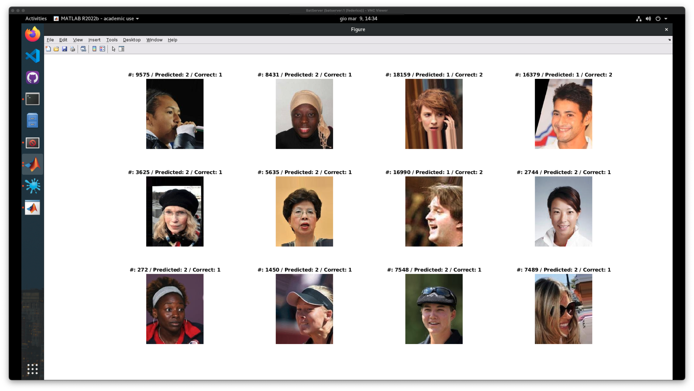
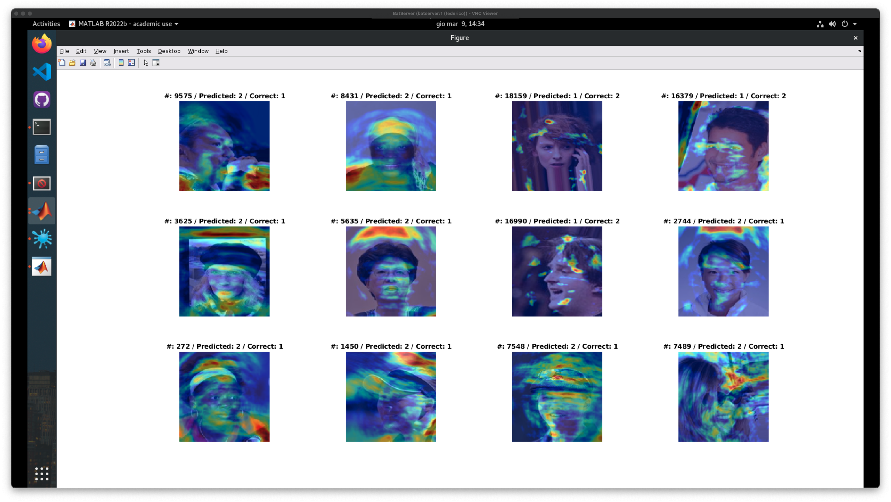

# Creazione di una nuova archietettura
Come ultimo esperimento abbiamo deciso di creare una nuova architettura da zero e di addestrarla per confrontare risultati con quelli ottenuti con le reti pre-addestrate.

>
> TABLE OF CONTENT  
>
> [Creazione di una nuova architettura](#creazione-di-una-nuova-archietettura)
>   1. [Opzioni e caricamento dei dati](#opzioni-e-caricamento-dei-dati)
>   1. [Creazione della nuova architettura](#creazione-della-nuova-architettura)
>   1. [Addestramento della nuova architettura](#addestramento-della-nuova-architettura)
>   1. [Risultati della nuova architettura](#risultati-della-nuova-architettura)
>   1. [Analisi degli errori](#analisi-degli-errori)
>   1. [Conclusioni](#conclusioni)
>   
> [Tentativo di creazione di una rete con due input](#tentativo-di-creazione-di-una-rete-con-due-input)
>   1. [La rete](#la-rete)
>   1. [Il caricamento dei dati e problemi derivanti](#il-caricamento-dei-dati-e-problemi-derivanti)
>   1. [Caricamento diretto in RAM](#caricamento-diretto-in-ram)
>   1. [Utilizzo dei datastore](#utilizzo-dei-datastore)
>   1. [Conclusioni esperimento con metadati](#conclusioni-esperimento-con-metadati)
>
> File di riferimento: [`custom_network.mlx`](../custom_network.mlx)
>

<br>

## **Opzioni e caricamento dei dati**
In maniera analoga agli altri esperimenti sono stati messi a disposizione dei flag di stampa per decidere se visualizzare o meno alcune immagini di training e test set con relative predizioni e la matrice di confusione.

```MATLAB
% === VARIABILI DI STAMPA === %
printTrainingSet = 1;
printTestSet = 1;
printConfMatrix = 1;
printErrors = 1;
```

Per il caricamento dei dati si è utilizzato un `imageDatastore` come descritto negli altri esperimenti.

```MATLAB
% caricamento dei dati
imdsTrain = imageDatastore ('dataset/TrainSet/', 'IncludeSubfolders', true, 'LabelSource', 'foldernames');
imdsTest = imageDatastore ('dataset/TestSet/', 'IncludeSubfolders', true, 'LabelSource', 'foldernames');
%numero di dati caricati
numTrainImages = numel (imdsTrain.Labels);
numTestImages = numel(imdsTest.Labels);
```

Dopodiché le immagini sono state ridimensionate ad una dimensione di 128x128 grazie all'utilizzo di `augmentedImageDatastore` come per gli altri esperimenti.

## **Creazione della nuova architettura**
Come primo test abbiamo creato un architettura realtivamente piccola composta da 9 livelli, di cui:

```MATLAB
layers = [
    imageInputLayer(imageInputSize, Normalization="zscore")
    convolution2dLayer(filterSize, numFilters)
    batchNormalizationLayer
    reluLayer
    fullyConnectedLayer(50)
    flattenLayer
    fullyConnectedLayer(numClasses)
    softmaxLayer
    classificationLayer];

lgraph = layerGraph(layers);
```


Nel livello di input abbiamo utilizzato una normalizzazione `zscore` per ottenere una media nulla e una varianza unitaria. Successivamente abbiamo utilizzato un `convolution2dLayer` con 130 filtri di dimensione 40x40, un `batchNormalizationLayer` e una `reluLayer`. Questi tre livelli sono stati utilizzati per ottenere una maggiore robustezza del modello.  
Dopodiché abbiamo utilizzato un `fullyConnectedLayer` con 50 neuroni e un `flattenLayer` per ottenere un vettore di features. Infine abbiamo utilizzato un `fullyConnectedLayer` con 2 neuroni per la classificazione e un `softmaxLayer` per ottenere le probabilità di appartenenza ad una delle due classi.

<br>

## **Addestramento della nuova architettura**

Una volta definita l'architettura della rete abbiamo ed effettuato il ridimensionamento delle immagini di training e test set, si è potuto procedere all'addestramento della rete definendo alcune opzioni di training.

```MATLAB
options = trainingOptions("sgdm", ...
    MaxEpochs=10, ...
    InitialLearnRate=0.0001, ...
    Plots="training-progress", ...
    MiniBatchSize=128, ...
    Verbose=1, ...
    ExecutionEnvironment="multi-gpu");

net = trainNetwork(augimdsTrain, lgraph, options);
```


Come si può notare dall'immagine sopra, l'addestramento è stato effettuato in 10 epoche, con un learning rate iniziale di 0.0001 e un mini-batch size di 128.

<br>

## **Risultati della nuova architettura**
Dopo aver addestrato la rete è stato calcolato l'errore sul test set e la matrice di confusione ottenendo i seguenti risulati:

|               |                 |
| -----------   | --------------- |
| **Accuracy**  | 96.09%          |
| **Rateo**     | 19182/19962     |  
| **Time**      | 5178.625s       |  

**Custom network confusion**
|               | **T Female**          |  **T Male**           |
| ---           | ---                   | ---                   |
| **P Female**  |  97.03% <br> (11916)  |  5.8% <br> (449)      |
| **P Male**    |  2.7% <br> (331)      |  94.2% <br> (7266)    |

Di seguito possiamo osservare alcune immagini di test e la loro classificazione effettuata dalla rete, con una gradcam per evidenziare le parti dell'immagine che hanno contribuito maggiormente alla classificazione:


Il modello si concentra sopratutto sul viso, nella parte inferiore, e sui capelli.

## **Analisi degli errori**
Possiamo osservare che la rete non ha commesso molti errori e i pochi che ha commesso sono stati commessi principalmente su immagini che presentavano soggetti che indossavano cappelli, quindi si presentava un problema di occlusione, oppure su immaigini che sono dovute essere pre-processate pesantemente e presentavano ricostruzione o parti nere dovute alla rotazione dell'immagine.

Di seguito alcuni esempi con gradCam associata:



Gli esempi confermano come nella maggior parte delle foto si presenti un problema di occlusione, che sia una mano davanti alla faccia, un cappello o i capelli che coprono il viso. Altri probelemi riscontrati sono pose di profilo e ricostruzione dell'immagine.

## Conclusioni
La rete riesce a tirare fuori dei buoni risultati nonostante la sua dimensione molto ridotta. Le considerazioni, simili a quelle riportate per l'esperimento dei finetuning, sono che questo non è il metodo migliore per la questo problema prendendo in considerazione risultati e tempo necessario per raggiungerli.

Di seguito una tabella riassuntiva:
|              | **Custom network** | **AlexNet FT** | **ResNet-50 FE w/ metadata** | **ResNet-50 w/ metadata & norm** | **VGG16 w/ metadata & norm** |
| -----------  | ------------------ | -------------  | ---------------------------- | -------------------------------- | ---------------------------- |
| **Accuracy** | 96.09%             | 96.59%         | 96.91%                       | 96.97%                           | 96.64%                       |
| **Delta**    | /                  | +0.50%         | +0.82%                       | +0.88%                           | +0.55%                       |


<br>

---
---
---

<br>

# **Tentativo di creazione di una rete con due input**
Dato che la rete, nonostante sia molto piccola, riesce a tirare fuori risultati soddisfacenti, piuttosto che cercare di renderla più prodonda abbiamo deciso di cercare di creare una rete che prende due input: immagini e metadati.

Abbiamo quindi rimodulato il codice dell'esperimento aggiungendo un flag in modo da "attivare" il secondo input:
```matlab
dualinput = 1;
```

## **La rete**

La rete di partenza è del tutto simile a quella precedente:
```matlab
layers = [
    imageInputLayer(imageInputSize,Normalization="zscore")
    convolution2dLayer(filterSize,numFilters)
    batchNormalizationLayer
    reluLayer
    fullyConnectedLayer(50)
    flattenLayer
    concatenationLayer(1,2,Name="cat") %differenza tra le due reti
    fullyConnectedLayer(numClasses)
    softmaxLayer
    classificationLayer];

lgraph = layerGraph(layers);
```

Come possiamo notare l'unica differenza è l'aggiunta del layer segnato con il commento di fianco. Questo layer ci servirà per passare da una rete "lineare" ad un "grafo", in quanto sarà il punto di incontro tra i due input.

```matlab
featInput = featureInputLayer(numFeatures,Name="features");
lgraph = addLayers(lgraph,featInput);
lgraph = connectLayers(lgraph,"features","cat/in2");
```

Il layer aggiuntivo viene collegato al concatenation layer con il seguente risultato:
> ricordarsi di aggiungere l'img


## **Il caricamento dei dati e problemi derivanti**
Abbiamo esplorato due possibili approcci per il caricamento dei dati:
- caricare in maniera diretta tutte le immagini in memoria
- utilizzare gli `imageDatastore`

> **NOTA:** verranno riportate le differenze rispetto al precedente esperimento

### **Caricamento diretto in RAM**
Caricando il dataset in RAM dagli `imageDatastore` richiede uno spazio di 17.6GB, il che introduce una prima limitazione hardware.

```matlab
%img
X1Train = readall(imdsTrain);
X1Train = cat(4,X1Train{:});

%labels
TTrain = imdsTrain.Labels;

%features
F = readmatrix('dataset/TrainSet_features.txt', 'Delimiter', ' ');
```

Dopodiché abbiamo dovuto caricare tutto in un arrayDatastore per poterlo passare alla rete:
```matlab
dsX1Train = arrayDatastore(X1Train,IterationDimension=42);
dsX2Train = arrayDatastore(F);
dsTTrain = arrayDatastore(TTrain);
dsTrain = combine(dsX1Train,dsX2Train,dsTTrain);
```

Nel momento in cui poi viene avviato il train della rete si out of memory e non è stato possibile concludere l'esperimento.

### **Utilizzo dei datastore**
Il secondo approccio, per evitare di esaurire la RAM, è stato quello continuare ad utilizzare gli `imageDatastore`.

```matlab
%labels
TTrain = imdsTrain.Labels;

%features
F = readmatrix('dataset/TrainSet_features.txt', 'Delimiter', ' ');
```

Poi al momento della `combine`:
```matlab
dsX2Train = arrayDatastore(F);
dsTTrain = arrayDatastore(TTrain);
dsTrain = combine(augimdsTest,dsX2Train,dsTTrain);
```
Qui invece al momento del train si presenta il problema che la rete si aspetta una feature per immagine ed invece se ne trova 39, questo è dovuto all'impossibilità di aggiungere il parametro `IterationDimension=42` come nel primo approccio.

## **Conclusioni esperimento con metadati**
Il tentativo di creare una rete con due input si è quindi interrotto non trovando una soluzione per il funzionamento.